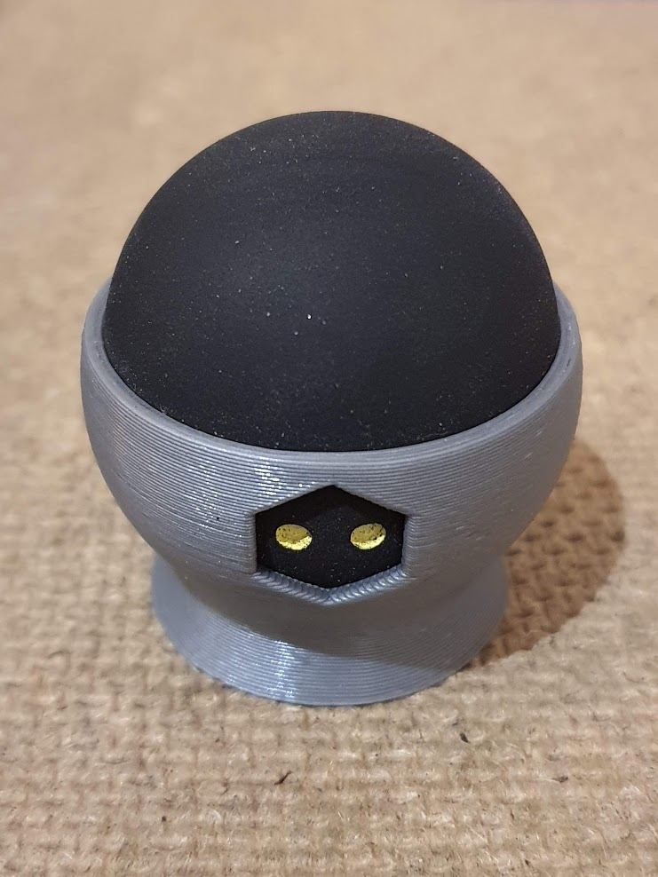

# Squash Foot 

> A printer foot utilizing hard squash balls for dampening.

The recommended voron rubber feet are not easily available everywhere. This 
foot allows installation using a single M5 BHCS screw. It will improve noise 
dampening and stands out less from the printer than the recommended rubber feet.

It is recommended to use hard squash balls. These are usually black and have 
two yellow dots (as seen in the image below).

## Printing Recommendation

## Changelog

### [1.0.0] - 2020-10-20
#### Added
- Basic variation of the squash foot

